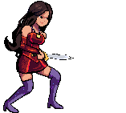

   

[my site](http://www.lootcomics.com)

---

### 🕹️ Active Projects

* **[LangExtract-Live](https://josepheinhorn.github.io/lang-extract-live/)** High-speed documentation-to-JSON engine for agentic tool ingestion.
* **[Physics Playground](https://josepheinhorn.github.io/physics-playground/)** Game-feel engine for 2D platformers and character physics.
* **[3D Print Estimator](https://josepheinhorn.github.io/3d-print-estimator/)** Instant material and cost analysis for Flashforge Adventurer 5M Pro builds.
* **[Sprite Sheet Slicer](https://josepheinhorn.github.io/sprite-sheet-slicer/)** Browser-native utility to stitch animation frames into professional sprite sheets.
* **[Context Shoveler](https://josepheinhorn.github.io/context-shoveler/)** High-speed codebase-to-prompt utility for Claude/GPT.

---

### 🎨 Current Work: 2D Side-Scroller Prototype
Am building a game featuring the pixel art character you see above. 
* **Genre:** Action Side-Scroller (Vibe: Dead Cells)
* **Status:** Designing animation sequences & core mechanics.

